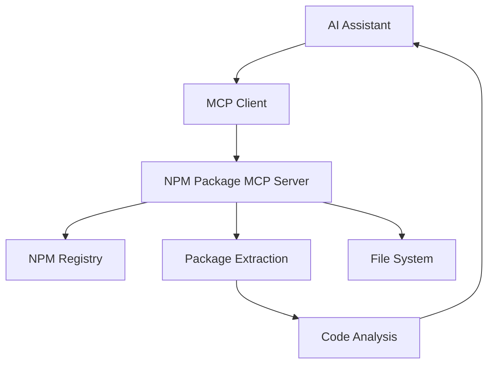

# 📦 NPM Package MCP Server

[](https://badge.fury.io/js/npm-package-mcp-server)
[](https://www.typescriptlang.org/)
[](https://opensource.org/licenses/MIT)
[](https://nodejs.org/)

> A powerful Model Context Protocol (MCP) server that enables AI assistants to fetch, explore, and analyze source code from any NPM package in real-time.

## 🚀 Quick Start

```bash
# Install
npm install -g npm-package-mcp-server

# Run
npm-package-mcp-server
```

## ✨ Features

- 📦 **Fetch Any NPM Package**: Download and explore source code from millions of packages
- 🔍 **Smart File Discovery**: List and filter files with intelligent code detection
- 📄 **Selective Code Reading**: Get specific files or entire codebases
- 🏷️ **Version Control**: Support for any published package version
- 🧹 **Auto Cleanup**: Automatic temporary file management
- 🔒 **Type Safe**: Full TypeScript support with comprehensive error handling
- ⚡ **ES Modules**: Modern JavaScript with optimal performance
- 🤖 **AI-Ready**: Perfect integration with Claude, ChatGPT, and other AI assistants

## 🎯 Use Cases

- **Code Analysis**: Analyze libraries before adopting them
- **Learning**: Study well-written open source code
- **AI Development**: Enable AI assistants to understand package internals
- **Documentation**: Generate docs by analyzing source code
- **Security Auditing**: Review dependencies for security issues
- **Migration Planning**: Understand APIs when upgrading packages

## 📖 API Reference

### Tools Available

#### `get_npm_package_code`
```typescript

## 🔧 Installation & Setup

### Option 1: Global Installation
```bash
npm install -g npm-package-mcp-server
npm-package-mcp-server
```

### Option 2: Local Development
```bash
git clone https://github.com/Ligament/npm-package-mcp-server.git
cd npm-package-mcp-server
npm install
npm run build
npm start
```

### Option 3: Docker
```bash
docker run -it npm-package-mcp-server
```

## 🤖 AI Assistant Integration

### Claude Desktop
Add to your `claude_desktop_config.json`:
```json
{
  "mcpServers": {
    "npm-packages": {
      "command": "npm-package-mcp-server"
    }
  }
}
```

### Other MCP Clients
Works with any MCP-compatible client. Configure stdio transport with the server command.

## 🏗️ Architecture



## 📊 Supported Packages

- ✅ All public NPM packages
- ✅ Scoped packages (`@org/package`)
- ✅ Any published version
- ✅ TypeScript and JavaScript
- ✅ React, Vue, Angular, Node.js packages
- ✅ Monorepo packages

## 🔥 Popular Packages to Explore

Try these commands with your AI assistant:

```
"Analyze the lodash utility functions"
"Show me the React hooks implementation"
"Explore the Express.js middleware system"
"Review the TypeScript compiler source"
```

## 🛠️ Development

### Scripts
```bash
npm run build      # Compile TypeScript
npm run dev        # Development with hot reload
npm run test       # Run tests
npm run clean      # Clean build artifacts
```

### Contributing
1. Fork the repository
2. Create feature branch: `git checkout -b feature/amazing-feature`
3. Commit changes: `git commit -m 'Add amazing feature'`
4. Push to branch: `git push origin feature/amazing-feature`
5. Open a Pull Request

## 📈 Performance

- **Fast Downloads**: Optimized npm registry API usage
- **Memory Efficient**: Streams large packages
- **Smart Caching**: Temporary file management
- **Error Recovery**: Robust error handling

## 🔒 Security

- **Read-Only**: Never modifies packages
- **Sandboxed**: Temporary extraction directories
- **No Execution**: Only reads source code
- **Public Packages Only**: No private registry access

## 🐛 Troubleshooting

| Issue | Solution |
|-------|----------|
| Package not found | Verify package name on [npmjs.com](https://npmjs.com) |
| Network errors | Check internet connectivity |
| Permission errors | Ensure Node.js 18+ and proper permissions |
| Large packages timeout | Try specific file paths instead of full package |

## 📄 License

MIT © [Ligament](https://github.com/Ligament)

## 🌟 Star History

<a href="https://www.star-history.com/#Ligament/npm-package-mcp-server&Date">
 <picture>
   <source media="(prefers-color-scheme: dark)" srcset="https://api.star-history.com/svg?repos=Ligament/npm-package-mcp-server&type=Date&theme=dark" />
   <source media="(prefers-color-scheme: light)" srcset="https://api.star-history.com/svg?repos=Ligament/npm-package-mcp-server&type=Date" />
   
 </picture>
</a>

## 🤝 Related Projects

- [Model Context Protocol](https://github.com/modelcontextprotocol/servers)
- [Claude Desktop](https://claude.ai/desktop)
- [NPM Registry API](https://github.com/npm/registry)

---

<div align="center">

**[⭐ Star this repo](https://github.com/Ligament/npm-package-mcp-server)** • **[🐛 Report Bug](https://github.com/Ligament/npm-package-mcp-server/issues)** • **[💡 Request Feature](https://github.com/Ligament/npm-package-mcp-server/issues)**

Made with ❤️ for the AI development community

</div>